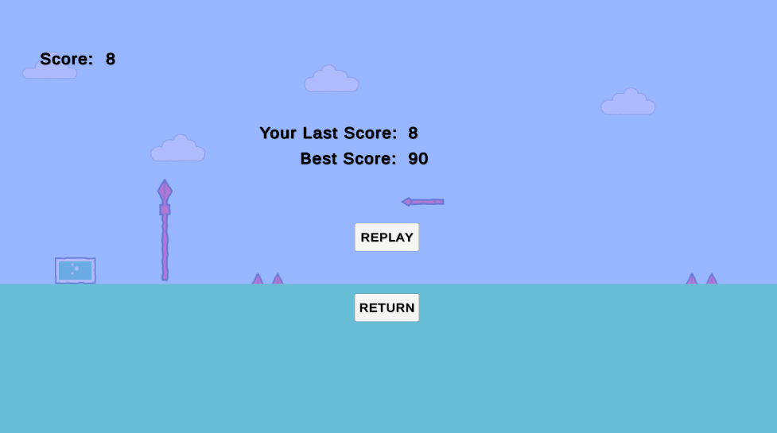
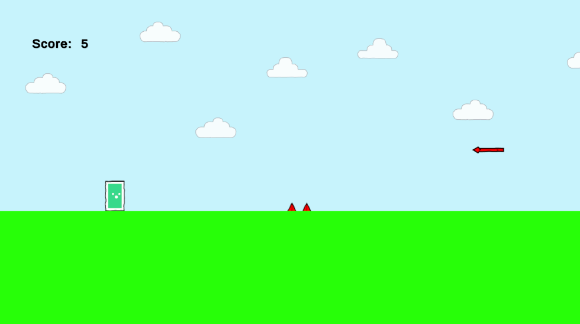

# 🕹️ Curso Introdutório de Desenvolvimento de Jogos com Unity 6

Este repositório contém o projeto completo desenvolvido durante um **curso introdutório de criação de jogos 2D com Unity 6**, voltado para iniciantes. O jogo criado é um **protótipo simples de corrida infinita**, inspirado no clássico jogo do dinossauro do Google Chrome.

## 🎮 Sobre o Jogo

O jogo é uma demonstração básica de um **infinite runner 2D**, com:
- Mecânica de pulo simples
- Obstáculos em movimento
- Controle de pontuação
- Sistema de colisão
- Reinício automático após Game Over

Ideal para quem está começando no desenvolvimento com Unity e quer entender o ciclo completo de criação de um jogo simples.

## 📺 Aulas no YouTube

Você pode acompanhar o passo a passo completo de criação deste projeto pela playlist no YouTube:

🔗 **[Clique aqui para acessar a playlist completa](https://www.youtube.com/playlist?list=PLv260ah47r6Lcx6VgeR7BiYDlV7-rggye)**

## 📂 Conteúdo do Repositório

- `Projeto_Completo/`: todos os arquivos do projeto Unity (.scenes, .prefabs, .scripts, etc.)
- `Scripts/`: pasta separada contendo apenas os scripts C# usados no projeto, para quem deseja estudar apenas o código

## 🖼️ Prints do Jogo

### Tela de jogo durante execução:

### Game Over:

## 🚀 Como Executar

1. Clone ou baixe este repositório
2. Abra o projeto com o **Unity 6.x ou superior**
3. Abra a cena principal (`Assets/Scenes/Game.unity`)
4. Clique em **Play** no editor da Unity

## ✅ Requisitos

- Unity 6.0.0 ou superior
- Sistema operacional: Windows, macOS ou Linux
- 2 GB de espaço em disco livre

## 👩‍💻 Para Estudo

Você pode usar este projeto como base para aprender:
- Estrutura de um projeto Unity
- Scripts em C# para mecânicas simples
- Organização básica de pastas e assets
- Boas práticas para jogos iniciantes

---

**Criado durante o curso introdutório de desenvolvimento de jogos com Unity.**

📬 *Sugestões e melhorias são bem-vindas!*

